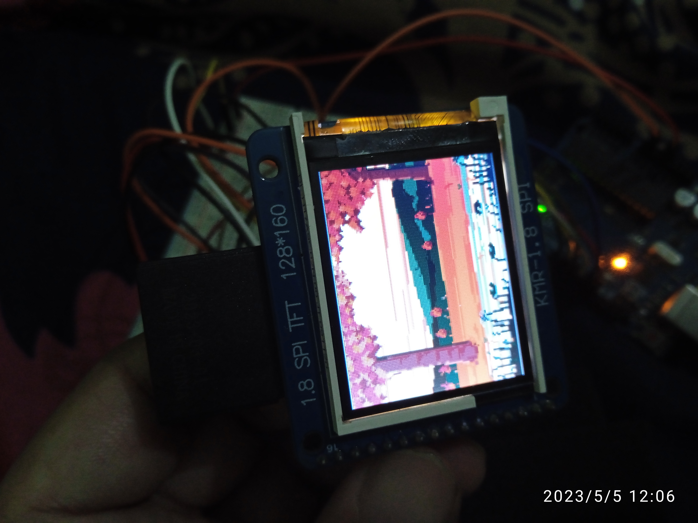

# KMR 1.8 SPI TFT 128x160

This TFT comes with a slot for SD Card that can be loaded to display image files (only .BMP files) from it. This TFT has total of 16 pins labelled as below :

1. LED-
1. LED+
1. SD_CS
1. MOSI
1. MISO
1. SCK
1. CS
1. SCL
1. SDA
1. A0
1. RESET
1. NC
1. NC
1. NC
1. Vcc
1. GND

To get started with the TFT, you need to make following connections in Arduino Uno :

| KMR TFT | Arduino Uno|
| --- | --- |
| LED- | GND |
| LED+ | Vcc (or 3.3V) |
| CS | Pin 10 |
| SCL | Pin 13 |
| SDA | Pin 11 |
| A0 | Pin 9 |
| RESET | Pin 8 |
| Vcc | Vcc |
| GND | GND |

## Sketch 1: KMR Chip Test

After making the above connections, you can use TFT library to display and test graphics. One test sketch that I found very useful was this [sketch_KMR_chip_test.ino](sketch_KMR_chip_test/sketch_KMR_chip_test.ino). I picked this sketch from [Arduino forum](https://forum.arduino.cc/t/graphics-library-for-cheap-kmr-1-8-spi-s6d02a1-and-ili9163-tft-displays/391450/12). This sketch tries to guess the chip that is driving the TFT.

Based on the result of this sketch I downloaded and installed **TFT_ILI9163** library. The **TFT_ILI9163** library worked with the TFT successfully. If you are running this sketch ( `sketch_KMR_chip_test.ino` ) then make sure **pins in the sketch** are described correctly and then run the sketch on the board. Also, in the sketch it said TFT_MOSI is connected to pin 11 but it actually meant SDA to pin 11. So you dont need to connect TFT_MOSI but TFT_SDA pin.

## Sketch 2: KMR TFT Image Display from SD card

If you want to attach SD card and use it for displaying images then you have to make following additional connections:

| KMR TFT | Arduino Uno|
| --- | --- |
| SD_CS | Pin 4 |
| MOSI | Pin 11 |
| MISO | Pin 12 |
| SCK | Pin 13 |

**Note**:- Some pins will reuse the pins from Arduino Uno and you may have to use a breadboard for it.

I used this sketch [sketch_SDcard_KMR.ino](sketch_SDcard_KMR/sketch_SDcard_KMR.ino) for displaying images. One of the limitation is that it renders only BMP image files. I used below image among few others from SD card to display on KMR TFT.

The image was rendered on KMR TFT as below :

## References
1. [Arduino forum](https://forum.arduino.cc/t/graphics-library-for-cheap-kmr-1-8-spi-s6d02a1-and-ili9163-tft-displays/391450/12)
2. [Michael Schoeffler's website](https://mschoeffler.com/2019/06/20/arduino-tutorial-making-the-kmr-1-8-spi-tft-display-work/)

